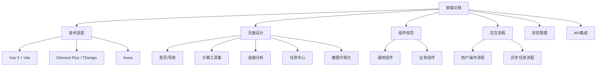

# 前端功能
对应api.md中计算接口的功能，做到界面展示（不用做登录认证等）

界面菜单
API文档，可以直接访问 http://localhost:8000/docs
算法列表 ，例如：
1. 波动率
2. 时间加权收益率
3. 最大回撤

任务管理
1. 查询异步任务状态
2. 获取任务记录列表（分页）
3. 获取任务详细记录
4. 获取任务统计信息
5. 获取任务面板数据
6. 清理旧任务记录

端口8080访问
http://localhost:8080

启动前端服务

主要功能包括：

### 核心功能模块
1. **简单计算** - 加减乘除运算
2. **复杂算法** - 平均值、方差、相关系数、斐波那契、阶乘等
3. **金融计算** - 最大回撤、时间加权收益率、波动率计算
4. **异步任务** - 异步计算任务创建
5. **任务管理** - 任务状态查询、记录列表、统计分析、任务面板

### 推荐的前端架构方案

文档结构：



### 文档内容大纲

我将为你创建包含以下内容的前端文档：

| 章节 | 内容描述 |
|------|---------|
| **1. 技术选型** | 推荐的前端框架、UI组件库、工具链 |
| **2. 项目结构** | 前端项目的目录组织规范 |
| **3. 页面设计** | 各功能页面的详细设计规范 |
| **4. 组件规范** | 可复用组件的定义和使用说明 |
| **5. API 集成** | 前后端接口对接方式 |
| **6. 状态管理** | 全局状态管理方案 |
| **7. 数据可视化** | 图表展示方案 |
| **8. 异步任务处理** | 异步计算任务的交互设计 |

### 特色设计亮点

1. **响应式设计** - 支持桌面端和移动端访问
2. **实时反馈** - 计算结果即时显示
3. **任务追踪** - 异步任务状态实时监控
4. **数据可视化** - 使用图表展示计算结果和统计信息
5. **批量操作** - 支持多组数据的批量计算

### 具体页面设计

我将详细规划以下页面：

| 页面 | 主要功能 |
|------|---------|
| **首页** | 功能导航、快速入口 |
| **简单计算器** | 加减乘除运算，实时显示结果 |
| **统计工具集** | 平均值、方差、相关系数等计算 |
| **数学工具集** | 斐波那契、阶乘等计算 |
| **金融分析** | 最大回撤、时间加权收益率、波动率 |
| **任务中心** | 任务列表、状态查询、统计分析 |
| **数据面板** | 任务统计图表、趋势分析 |

### 推荐技术栈

```javascript
// 推荐的前端技术栈组合
{
  "框架": "Vue 3 + Vite",
  "UI组件": "Element Plus / TDesign Vue",
  "HTTP客户端": "Axios",
  "状态管理": "Pinia",
  "图表库": "ECharts",
  "表单验证": "VeeValidate / Element Plus Form",
  "CSS框架": "Tailwind CSS / UnoCSS"
}
```


