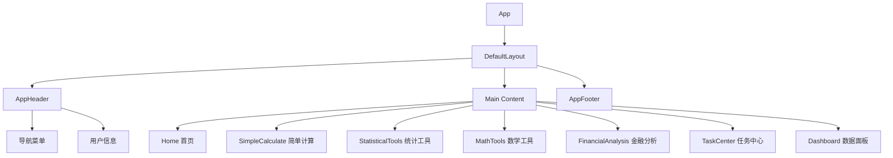
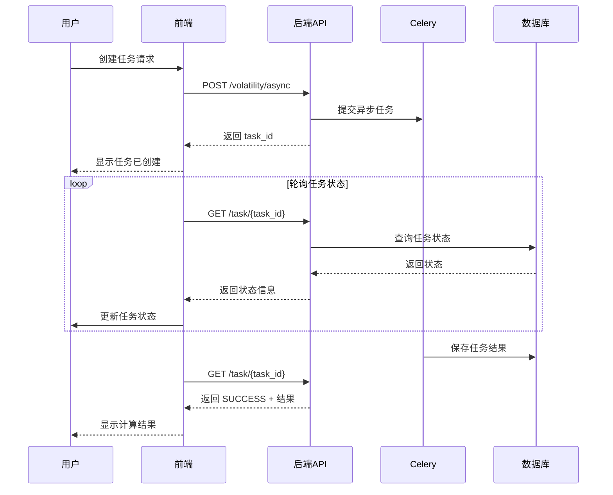

好的！现在我将为你编写完整的前端文档。这个文档将详细说明如何将后端 API 功能通过界面化的方式呈现出来。

---

# 📱 前端开发文档

## 目录

1. [技术选型](#1-技术选型)
2. [项目结构](#2-项目结构)
3. [页面设计](#3-页面设计)
4. [组件规范](#4-组件规范)
5. [API 集成](#5-api-集成)
6. [状态管理](#6-状态管理)
7. [数据可视化](#7-数据可视化)
8. [异步任务处理](#8-异步任务处理)
9. [响应式设计](#9-响应式设计)
10. [部署指南](#10-部署指南)

---

## 1. 技术选型

### 1.1 推荐技术栈

基于项目需求和后端 API 特性，推荐使用以下技术栈：

| 类别 | 推荐方案 | 替代方案 | 说明 |
|------|---------|---------|------|
| **前端框架** | Vue 3 (Composition API) | React 18 | Vue 3 学习曲线平缓，生态完善 |
| **构建工具** | Vite 5.x | Webpack 5 | Vite 开发体验极佳，构建速度快 |
| **UI 组件库** | Element Plus | TDesign Vue / Ant Design Vue | Element Plus 组件丰富，文档完善 |
| **状态管理** | Pinia | Vuex | Pinia 是 Vue 3 官方推荐的状态管理方案 |
| **HTTP 客户端** | Axios | Fetch API | Axios 功能强大，拦截器完善 |
| **图表库** | ECharts 5.x | Chart.js / D3.js | ECharts 在中国生态最完善 |
| **表单验证** | VeeValidate + Yup | Element Plus Form Validation | 更灵活的验证方案 |
| **CSS 框架** | Tailwind CSS / UnoCSS | Bootstrap | 原子化 CSS，按需生成 |
| **代码规范** | ESLint + Prettier | - | 统一代码风格 |
| **类型检查** | TypeScript 5.x | JavaScript | 提供类型安全 |

### 1.2 技术选型理由

#### 为什么选择 Vue 3 + Element Plus？

```javascript
// ✅ 优势 1: Composition API 让逻辑复用更简单
import { ref, computed } from 'vue'

export function useCalculator() {
  const result = ref(0)
  const loading = ref(false)
  
  const calculate = async (a, b, operation) => {
    loading.value = true
    try {
      const response = await api.calculate({ a, b, operation })
      result.value = response.data.result
    } finally {
      loading.value = false
    }
  }
  
  return { result, loading, calculate }
}
```

```javascript
// ✅ 优势 2: Element Plus 提供丰富的表单和表格组件
<template>
  <el-form :model="form" :rules="rules" ref="formRef">
    <el-form-item label="第一个数" prop="a">
      <el-input-number v-model="form.a" :precision="2" />
    </el-form-item>
    <el-form-item>
      <el-button type="primary" @click="calculate">计算</el-button>
    </el-form-item>
  </el-form>
</template>
```

### 1.3 开发环境配置

```bash
# 1. 创建 Vue 3 + Vite 项目
npm create vue@latest compute-engine-frontend
cd compute-engine-frontend

# 2. 安装依赖
npm install

# 3. 安装 Element Plus
npm install element-plus @element-plus/icons-vue

# 4. 安装其他依赖
npm install axios pinia echarts vue-echarts
npm install -D unplugin-vue-components unplugin-auto-import
npm install -D tailwindcss postcss autoprefixer

# 5. 启动开发服务器
npm run dev
```

### 1.4 项目初始化配置

**vite.config.ts**
```typescript
import { defineConfig } from 'vite'
import vue from '@vitejs/plugin-vue'
import AutoImport from 'unplugin-auto-import/vite'
import Components from 'unplugin-vue-components/vite'
import { ElementPlusResolver } from 'unplugin-vue-components/resolvers'

export default defineConfig({
  plugins: [
    vue(),
    AutoImport({
      resolvers: [ElementPlusResolver()],
      imports: ['vue', 'vue-router', 'pinia']
    }),
    Components({
      resolvers: [ElementPlusResolver()]
    })
  ],
  server: {
    proxy: {
      '/api': {
        target: 'http://localhost:8000',
        changeOrigin: true
      }
    }
  }
})
```

---

## 2. 项目结构

### 2.1 推荐目录结构

```
compute-engine-frontend/
├── public/                      # 静态资源
│   ├── favicon.ico
│   └── logo.png
├── src/
│   ├── api/                     # API 接口层
│   │   ├── index.ts            # API 入口文件
│   │   ├── calculate.ts        # 计算相关接口
│   │   ├── algorithms.ts       # 算法相关接口
│   │   ├── tasks.ts            # 任务管理接口
│   │   └── types.ts            # TypeScript 类型定义
│   ├── assets/                  # 资源文件
│   │   ├── images/
│   │   └── styles/
│   ├── components/              # 可复用组件
│   │   ├── common/             # 通用组件
│   │   │   ├── AppHeader.vue   # 页面头部
│   │   │   ├── AppFooter.vue   # 页面底部
│   │   │   ├── LoadingSpinner.vue
│   │   │   └── ErrorAlert.vue
│   │   ├── calculator/         # 计算器组件
│   │   │   ├── SimpleCalculator.vue
│   │   │   ├── ArrayInput.vue
│   │   │   └── ResultDisplay.vue
│   │   ├── tasks/              # 任务相关组件
│   │   │   ├── TaskList.vue
│   │   │   ├── TaskStatus.vue
│   │   │   ├── TaskDetail.vue
│   │   │   └── TaskStatistics.vue
│   │   └── charts/             # 图表组件
│   │       ├── LineChart.vue
│   │       ├── BarChart.vue
│   │       └── PieChart.vue
│   ├── composables/             # 组合式函数
│   │   ├── useCalculate.ts
│   │   ├── useTasks.ts
│   │   ├── useCharts.ts
│   │   └── useWebSocket.ts
│   ├── layouts/                 # 布局组件
│   │   ├── DefaultLayout.vue
│   │   └── BlankLayout.vue
│   ├── router/                  # 路由配置
│   │   └── index.ts
│   ├── stores/                  # Pinia 状态管理
│   │   ├── index.ts
│   │   ├── user.ts
│   │   ├── task.ts
│   │   └── calculator.ts
│   ├── utils/                   # 工具函数
│   │   ├── request.ts          # Axios 封装
│   │   ├── format.ts           # 格式化工具
│   │   ├── validate.ts         # 验证工具
│   │   └── constants.ts        # 常量定义
│   ├── views/                   # 页面组件
│   │   ├── Home.vue            # 首页
│   │   ├── SimpleCalculate.vue # 简单计算
│   │   ├── StatisticalTools.vue # 统计工具
│   │   ├── MathTools.vue       # 数学工具
│   │   ├── FinancialAnalysis.vue # 金融分析
│   │   ├── TaskCenter.vue      # 任务中心
│   │   ├── Dashboard.vue       # 数据面板
│   │   └── History.vue         # 历史记录
│   ├── App.vue                  # 根组件
│   └── main.ts                  # 应用入口
├── .env.development              # 开发环境变量
├── .env.production               # 生产环境变量
├── .eslintrc.cjs               # ESLint 配置
├── .prettierrc.json            # Prettier 配置
├── tailwind.config.js          # Tailwind 配置
├── tsconfig.json               # TypeScript 配置
├── package.json
└── vite.config.ts              # Vite 配置
```

### 2.2 目录说明

| 目录 | 用途 |
|------|------|
| **api/** | 封装所有与后端 API 的交互，包括请求方法、类型定义 |
| **components/** | 可复用的 Vue 组件，按功能模块组织 |
| **composables/** | Vue 3 组合式函数，实现逻辑复用 |
| **layouts/** | 页面布局组件，如默认布局、空白布局 |
| **router/** | Vue Router 路由配置 |
| **stores/** | Pinia 状态管理 store |
| **utils/** | 工具函数，如请求封装、格式化、验证等 |
| **views/** | 页面级组件，对应路由的各个页面 |

---

## 3. 页面设计

### 3.1 页面架构总览



### 3.2 首页 (Home)

**功能描述**：系统导航首页，提供快速入口和功能概览

**布局设计**：

```
┌─────────────────────────────────────────────┐
│              App Header (导航栏)              │
├─────────────────────────────────────────────┤
│                                             │
│   🎯 计算引擎 - 高性能计算平台                 │
│                                             │
│   ┌──────────┐ ┌──────────┐ ┌──────────┐   │
│   │简单计算器 │ │统计工具集 │ │金融分析  │   │
│   │  入口   │ │  入口   │ │  入口   │   │
│   └──────────┘ └──────────┘ └──────────┘   │
│                                             │
│   ┌──────────┐ ┌──────────┐ ┌──────────┐   │
│   │数学工具  │ │任务中心  │ │数据面板  │   │
│   │  入口   │ │  入口   │ │  入口   │   │
│   └──────────┘ └──────────┘ └──────────┘   │
│                                             │
│   📊 统计概览                                │
│   总任务数: 100 | 成功率: 85%              │
│                                             │
└─────────────────────────────────────────────┘
```

**组件代码示例**：

```vue
<template>
  <div class="home-container">
    <!-- Banner -->
    <div class="hero-section">
      <h1>🎯 计算引擎</h1>
      <p>高性能实时计算与异步任务处理平台</p>
    </div>

    <!-- 功能入口网格 -->
    <div class="feature-grid">
      <FeatureCard 
        v-for="feature in features" 
        :key="feature.id"
        :icon="feature.icon"
        :title="feature.title"
        :description="feature.description"
        :route="feature.route"
      />
    </div>

    <!-- 统计概览 -->
    <div class="stats-section">
      <h2>📊 系统统计</h2>
      <el-row :gutter="20">
        <el-col :span="6">
          <StatCard title="总任务数" :value="statistics.totalTasks" />
        </el-col>
        <el-col :span="6">
          <StatCard title="成功率" :value="statistics.successRate" unit="%" />
        </el-col>
        <el-col :span="6">
          <StatCard title="平均执行时间" :value="statistics.avgExecutionTime" unit="s" />
        </el-col>
        <el-col :span="6">
          <StatCard title="今日任务" :value="statistics.todayTasks" />
        </el-col>
      </el-row>
    </div>
  </div>
</template>

<script setup lang="ts">
import { ref, onMounted } from 'vue'
import { useRouter } from 'vue-router'
import { useDashboardStore } from '@/stores/dashboard'

const router = useRouter()
const dashboardStore = useDashboardStore()

const features = [
  { id: 1, title: '简单计算器', description: '基础的四则运算', icon: 'Calculator', route: '/simple-calculate' },
  { id: 2, title: '统计工具集', description: '平均值、方差等', icon: 'DataAnalysis', route: '/statistical-tools' },
  { id: 3, title: '金融分析', description: '回撤、收益率等', icon: 'TrendCharts', route: '/financial-analysis' },
  { id: 4, title: '数学工具', description: '斐波那契、阶乘等', icon: 'Math', route: '/math-tools' },
  { id: 5, title: '任务中心', description: '管理异步任务', icon: 'List', route: '/task-center' },
  { id: 6, title: '数据面板', description: '可视化统计分析', icon: 'PieChart', route: '/dashboard' }
]

const statistics = ref({
  totalTasks: 0,
  successRate: 0,
  avgExecutionTime: 0,
  todayTasks: 0
})

onMounted(async () => {
  await dashboardStore.fetchDashboardData()
  statistics.value = dashboardStore.statistics
})
</script>

<style scoped>
.home-container {
  padding: 20px;
}

.hero-section {
  text-align: center;
  padding: 60px 20px;
  background: linear-gradient(135deg, #667eea 0%, #764ba2 100%);
  color: white;
  border-radius: 12px;
  margin-bottom: 40px;
}

.feature-grid {
  display: grid;
  grid-template-columns: repeat(auto-fit, minmax(250px, 1fr));
  gap: 20px;
  margin-bottom: 40px;
}

.stats-section {
  background: white;
  padding: 20px;
  border-radius: 8px;
}
</style>
```

### 3.3 简单计算器 (SimpleCalculate)

**功能描述**：提供加、减、乘、除四则运算的界面

**布局设计**：

```
┌─────────────────────────────────────────────┐
│  简单计算器                                  │
├─────────────────────────────────────────────┤
│                                             │
│   第一个数: [    10    ]                    │
│                                             │
│   操作符: [ 加 ▼ ]                          │
│           (加 / 减 / 乘 / 除)               │
│                                             │
│   第二个数: [    5     ]                    │
│                                             │
│   ┌───────────────────────────────┐        │
│   │         [ 计算 ]               │        │
│   └───────────────────────────────┘        │
│                                             │
│   ┌─────────────────────────────────────┐  │
│   │  结果: 15.0                        │  │
│   │  执行时间: 0.000123 秒              │  │
│   └─────────────────────────────────────┘  │
│                                             │
│   📜 历史记录:                               │
│   • 10 + 5 = 15 (2024-01-23 10:00)        │
│   • 20 * 3 = 60 (2024-01-23 09:55)        │
│                                             │
└─────────────────────────────────────────────┘
```

**组件代码示例**：

```vue
<template>
  <div class="simple-calculate-container">
    <el-card class="calculator-card">
      <template #header>
        <div class="card-header">
          <el-icon><Calculator /></el-icon>
          <span>简单计算器</span>
        </div>
      </template>

      <el-form :model="form" :rules="rules" ref="formRef" label-width="100px">
        <el-form-item label="第一个数" prop="a">
          <el-input-number 
            v-model="form.a" 
            :precision="4"
            :step="0.1"
            style="width: 100%"
          />
        </el-form-item>

        <el-form-item label="操作符" prop="operation">
          <el-select v-model="form.operation" style="width: 100%">
            <el-option label="加 (+)" value="+" />
            <el-option label="减 (-)" value="-" />
            <el-option label="乘 (×)" value="*" />
            <el-option label="除 (÷)" value="/" />
          </el-select>
        </el-form-item>

        <el-form-item label="第二个数" prop="b">
          <el-input-number 
            v-model="form.b" 
            :precision="4"
            :step="0.1"
            style="width: 100%"
          />
        </el-form-item>

        <el-form-item>
          <el-button 
            type="primary" 
            @click="handleCalculate" 
            :loading="loading"
            size="large"
            style="width: 100%"
          >
            计算
          </el-button>
        </el-form-item>
      </el-form>

      <!-- 结果显示 -->
      <el-divider />

      <div v-if="result !== null" class="result-section">
        <el-result 
          icon="success"
          :title="`计算结果: ${result}`"
          :sub-title="`执行时间: ${executionTime} 秒`"
        />
      </div>

      <!-- 历史记录 -->
      <el-divider content-position="left">📜 历史记录</el-divider>
      <el-table :data="history" style="width: 100%" size="small">
        <el-table-column prop="expression" label="计算表达式" />
        <el-table-column prop="result" label="结果" width="120" />
        <el-table-column prop="time" label="时间" width="160" />
      </el-table>
    </el-card>
  </div>
</template>

<script setup lang="ts">
import { ref, reactive } from 'vue'
import { ElMessage } from 'element-plus'
import { Calculator } from '@element-plus/icons-vue'
import { useCalculate } from '@/composables/useCalculate'

const { calculate, loading } = useCalculate()

const formRef = ref()
const form = reactive({
  a: 0,
  b: 0,
  operation: '+'
})

const rules = {
  a: [{ required: true, message: '请输入第一个数', trigger: 'blur' }],
  b: [{ required: true, message: '请输入第二个数', trigger: 'blur' }],
  operation: [{ required: true, message: '请选择操作符', trigger: 'change' }]
}

const result = ref<number | null>(null)
const executionTime = ref(0)
const history = ref<Array<any>>([])

const handleCalculate = async () => {
  try {
    await formRef.value.validate()
    
    const response = await calculate(form.a, form.b, form.operation)
    result.value = response.data.result
    executionTime.value = response.data.execution_time

    // 添加到历史记录
    history.value.unshift({
      expression: `${form.a} ${form.operation} ${form.b}`,
      result: result.value,
      time: new Date().toLocaleString()
    })

    ElMessage.success('计算成功')
  } catch (error: any) {
    if (error?.response?.data?.detail) {
      ElMessage.error(error.response.data.detail)
    } else {
      ElMessage.error('计算失败，请检查输入')
    }
  }
}
</script>

<style scoped>
.simple-calculate-container {
  max-width: 600px;
  margin: 0 auto;
}

.card-header {
  display: flex;
  align-items: center;
  gap: 8px;
  font-size: 18px;
  font-weight: bold;
}

.result-section {
  margin: 20px 0;
}
</style>
```

### 3.4 统计工具集 (StatisticalTools)

**功能描述**：平均值、方差、相关系数等统计计算工具

**布局设计**：

```
┌─────────────────────────────────────────────┐
│  统计工具集                                  │
├─────────────────────────────────────────────┤
│                                             │
│  [ 平均值 ] [ 方差 ] [ 相关系数 ]            │
│                                             │
│  ━━━━━━━━━━━━━━━━━━━━━━━━━━━━━━━━━━━━━━━  │
│                                             │
│  📊 平均值计算                               │
│                                             │
│  输入数字列表（用逗号或换行分隔）:            │
│  ┌───────────────────────────────────────┐ │
│  │ 1, 2, 3, 4, 5                         │ │
│  │                                       │ │
│  └───────────────────────────────────────┘ │
│                                             │
│  [ 计算平均值 ] [ 清空 ] [ 导入CSV ]        │
│                                             │
│  结果: 3.0                                  │
│  执行时间: 0.0001 秒                        │
│                                             │
└─────────────────────────────────────────────┘
```

**组件代码示例**：

```vue
<template>
  <div class="statistical-tools-container">
    <el-tabs v-model="activeTab" type="border-card">
      <!-- 平均值 -->
      <el-tab-pane label="平均值" name="mean">
        <ArrayInputPanel
          title="平均值计算"
          description="计算一组数字的算术平均值"
          placeholder="输入数字列表，用逗号、空格或换行分隔"
          @calculate="handleCalculateMean"
        />
      </el-tab-pane>

      <!-- 方差 -->
      <el-tab-pane label="方差" name="variance">
        <ArrayInputPanel
          title="方差计算"
          description="计算一组数字的方差（至少需要2个数字）"
          placeholder="输入数字列表，用逗号、空格或换行分隔"
          :minLength="2"
          @calculate="handleCalculateVariance"
        />
      </el-tab-pane>

      <!-- 相关系数 -->
      <el-tab-pane label="相关系数" name="correlation">
        <CorrelationPanel @calculate="handleCalculateCorrelation" />
      </el-tab-pane>
    </el-tabs>
  </div>
</template>

<script setup lang="ts">
import { ref } from 'vue'
import { useStatisticalTools } from '@/composables/useStatisticalTools'
import ArrayInputPanel from '@/components/calculator/ArrayInputPanel.vue'
import CorrelationPanel from '@/components/calculator/CorrelationPanel.vue'

const activeTab = ref('mean')
const { calculateMean, calculateVariance, calculateCorrelation } = useStatisticalTools()

const handleCalculateMean = async (numbers: number[]) => {
  const response = await calculateMean(numbers)
  return {
    result: response.data.result,
    executionTime: response.data.execution_time
  }
}

const handleCalculateVariance = async (numbers: number[]) => {
  const response = await calculateVariance(numbers)
  return {
    result: response.data.result,
    executionTime: response.data.execution_time
  }
}

const handleCalculateCorrelation = async (x: number[], y: number[]) => {
  const response = await calculateCorrelation(x, y)
  return {
    result: response.data.result,
    executionTime: response.data.execution_time
  }
}
</script>
```

### 3.5 金融分析 (FinancialAnalysis)

**功能描述**：最大回撤、时间加权收益率、波动率等金融计算工具

**布局设计**：

```
┌─────────────────────────────────────────────┐
│  金融分析                                    │
├─────────────────────────────────────────────┤
│                                             │
│  [ 最大回撤 ] [ 时间加权收益率 ] [ 波动率 ]   │
│                                             │
│  ━━━━━━━━━━━━━━━━━━━━━━━━━━━━━━━━━━━━━━━  │
│                                             │
│  📉 最大回撤计算                             │
│                                             │
│  数据输入方式: [ 手动输入 ] [ 上传CSV ]       │
│                                             │
│  每日数据列表:                               │
│  ┌───────────────────────────────────────┐ │
│  │ 日期        | 当日收益   | 平均资金占用│ │
│  │ 2024-01-01 | 1000.5    | 100000.0   │ │
│  │ 2024-01-02 | -500.0    | 100500.0   │ │
│  │ 2024-01-03 | 800.0     | 100000.0   │ │
│  │ [ 添加一行 ]                           │ │
│  └───────────────────────────────────────┘ │
│                                             │
│  [ 计算最大回撤 ]                            │
│                                             │
│  结果: 1.49%                                │
│                                             │
└─────────────────────────────────────────────┘
```

### 3.6 任务中心 (TaskCenter)

**功能描述**：查看和管理所有异步任务

**布局设计**：

```
┌─────────────────────────────────────────────┐
│  任务中心                     [ 创建任务 ]   │
├─────────────────────────────────────────────┤
│                                             │
│  筛选: [ 全部 ] [ 成功 ] [ 失败 ] [ 进行中 ] │
│  搜索: [             ]                      │
│                                             │
│  ┌───────────────────────────────────────┐ │
│  │ 任务ID: 65535f38...      [ 成功 ] ✓   │ │
│  │ 算法: 波动率计算                      │ │
│  │ 创建时间: 2024-01-23 10:30:00        │ │
│  │ 执行时间: 2.3秒                       │ │
│  │                     [ 查看详情 ] [ 删除]│ │
│  ├───────────────────────────────────────┤ │
│  │ 任务ID: 72346f12...      [ 进行中 ] ⏳│ │
│  │ 算法: 时间加权收益率                   │ │
│  │ 创建时间: 2024-01-23 10:35:00        │ │
│  │ 状态: 正在执行中...                   │ │
│  │                     [ 查看进度 ]      │ │
│  └───────────────────────────────────────┘ │
│                                             │
│  共 100 条记录  < 1 2 3 4 5 >              │
│                                             │
└─────────────────────────────────────────────┘
```

**组件代码示例**：

```vue
<template>
  <div class="task-center-container">
    <!-- 操作栏 -->
    <div class="action-bar">
      <el-button type="primary" @click="showCreateTaskDialog">
        <el-icon><Plus /></el-icon>
        创建任务
      </el-button>
      <el-button @click="refreshTasks">
        <el-icon><Refresh /></el-icon>
        刷新
      </el-button>
      
      <div class="filters">
        <el-radio-group v-model="statusFilter" @change="fetchTasks">
          <el-radio-button label="">全部</el-radio-button>
          <el-radio-button label="SUCCESS">成功</el-radio-button>
          <el-radio-button label="FAILURE">失败</el-radio-button>
          <el-radio-button label="PENDING">等待中</el-radio-button>
          <el-radio-button label="STARTED">进行中</el-radio-button>
        </el-radio-group>
        
        <el-input
          v-model="searchQuery"
          placeholder="搜索任务ID或算法类型"
          clearable
          style="width: 300px; margin-left: 10px"
        >
          <template #prefix>
            <el-icon><Search /></el-icon>
          </template>
        </el-input>
      </div>
    </div>

    <!-- 任务列表 -->
    <el-table :data="filteredTasks" v-loading="loading">
      <el-table-column prop="task_id" label="任务ID" width="200">
        <template #default="{ row }">
          <el-text type="primary" style="font-family: monospace">
            {{ row.task_id.substring(0, 12) }}...
          </el-text>
        </template>
      </el-table-column>
      
      <el-table-column prop="algorithm" label="算法类型" width="150" />
      
      <el-table-column prop="status" label="状态" width="100">
        <template #default="{ row }">
          <el-tag :type="getStatusType(row.status)">
            {{ getStatusText(row.status) }}
          </el-tag>
        </template>
      </el-table-column>
      
      <el-table-column prop="created_at" label="创建时间" width="180" />
      
      <el-table-column prop="execution_time" label="执行时间(秒)" width="120" />
      
      <el-table-column label="操作" width="180">
        <template #default="{ row }">
          <el-button link type="primary" @click="viewTaskDetail(row)">
            查看详情
          </el-button>
          <el-button 
            link 
            type="danger" 
            v-if="row.status === 'FAILURE' || row.status === 'SUCCESS'"
            @click="deleteTask(row.id)"
          >
            删除
          </el-button>
        </template>
      </el-table-column>
    </el-table>

    <!-- 分页 -->
    <el-pagination
      v-model:current-page="currentPage"
      v-model:page-size="pageSize"
      :total="total"
      :page-sizes="[10, 20, 50, 100]"
      layout="total, sizes, prev, pager, next, jumper"
      @change="fetchTasks"
      style="margin-top: 20px; justify-content: center"
    />

    <!-- 创建任务对话框 -->
    <el-dialog v-model="createTaskDialogVisible" title="创建异步任务" width="600px">
      <CreateTaskForm @created="handleTaskCreated" />
    </el-dialog>

    <!-- 任务详情对话框 -->
    <el-dialog v-model="detailDialogVisible" title="任务详情" width="800px">
      <TaskDetail v-if="currentTask" :task="currentTask" />
    </el-dialog>
  </div>
</template>

<script setup lang="ts">
import { ref, computed, onMounted } from 'vue'
import { ElMessage, ElMessageBox } from 'element-plus'
import { Plus, Refresh, Search } from '@element-plus/icons-vue'
import { useTasks } from '@/composables/useTasks'

const { tasks, loading, fetchTasks, deleteTask, getTaskDetail } = useTasks()

const statusFilter = ref('')
const searchQuery = ref('')
const currentPage = ref(1)
const pageSize = ref(20)
const total = ref(0)
const createTaskDialogVisible = ref(false)
const detailDialogVisible = ref(false)
const currentTask = ref<any>(null)

// 过滤任务
const filteredTasks = computed(() => {
  return tasks.value.filter(task => {
    const matchStatus = !statusFilter.value || task.status === statusFilter.value
    const matchSearch = !searchQuery.value || 
      task.task_id.toLowerCase().includes(searchQuery.value.toLowerCase()) ||
      task.algorithm.toLowerCase().includes(searchQuery.value.toLowerCase())
    return matchStatus && matchSearch
  })
})

const refreshTasks = async () => {
  await fetchTasks()
  ElMessage.success('刷新成功')
}

const showCreateTaskDialog = () => {
  createTaskDialogVisible.value = true
}

const handleTaskCreated = () => {
  createTaskDialogVisible.value = false
  refreshTasks()
}

const viewTaskDetail = async (task: any) => {
  currentTask.value = await getTaskDetail(task.task_id)
  detailDialogVisible.value = true
}

const deleteTaskConfirm = (taskId: number) => {
  ElMessageBox.confirm('确定要删除这个任务吗？', '确认删除', {
    type: 'warning'
  }).then(async () => {
    await deleteTask(taskId)
    ElMessage.success('删除成功')
    refreshTasks()
  })
}

const getStatusType = (status: string) => {
  const types: Record<string, any> = {
    SUCCESS: 'success',
    FAILURE: 'danger',
    PENDING: 'info',
    STARTED: 'warning',
    RETRY: 'warning',
    REVOKED: 'info'
  }
  return types[status] || 'info'
}

const getStatusText = (status: string) => {
  const texts: Record<string, string> = {
    SUCCESS: '成功',
    FAILURE: '失败',
    PENDING: '等待中',
    STARTED: '进行中',
    RETRY: '重试中',
    REVOKED: '已撤销'
  }
  return texts[status] || status
}

onMounted(() => {
  fetchTasks()
})
</script>

<style scoped>
.task-center-container {
  padding: 20px;
}

.action-bar {
  display: flex;
  justify-content: space-between;
  align-items: center;
  margin-bottom: 20px;
}

.filters {
  display: flex;
  align-items: center;
}
</style>
```

### 3.7 数据面板 (Dashboard)

**功能描述**：可视化展示任务统计数据和趋势

**布局设计**：

```
┌─────────────────────────────────────────────┐
│  数据面板                                    │
├─────────────────────────────────────────────┤
│                                             │
│  时间范围: [ 最近7天 ▼ ]  [ 刷新 ]           │
│                                             │
│  ┌─────────┐ ┌─────────┐ ┌─────────┐       │
│  │总任务数 │ │成功率  │ │平均时长 │       │
│  │  156   │ │  92%   │ │ 0.25s  │       │
│  └─────────┘ └─────────┘ └─────────┘       │
│                                             │
│  📊 任务趋势（近7天）                        │
│  ┌───────────────────────────────────────┐ │
│  │  [ 折线图：每日任务数量 ]             │ │
│  │                                       │ │
│  │  50 │        ●                       │ │
│  │    │      ●   ●                      │ │
│  │  25 │    ●       ●    ●              │ │
│  │    │  ●             ●    ●          │ │
│  │   0└─────────────────────────         │ │
│  │     周一 周二 周三 周四 周五 周六 周日 │ │
│  └───────────────────────────────────────┘ │
│                                             │
│  📈 各算法使用分布                           │
│  ┌───────────────────────────────────────┐ │
│  │  [ 饼图：各算法任务占比 ]              │ │
│  │  ● 波动率 45%                         │ │
│  │  ● 平均值 30%                         │ │
│  │  ● 回撤 15%                           │ │
│  │  ● 其他 10%                           │ │
│  └───────────────────────────────────────┘ │
│                                             │
└─────────────────────────────────────────────┘
```

**组件代码示例**：

```vue
<template>
  <div class="dashboard-container">
    <!-- 操作栏 -->
    <div class="action-bar">
      <el-select v-model="timeRange" @change="loadDashboardData" style="width: 150px">
        <el-option label="最近7天" :value="7" />
        <el-option label="最近30天" :value="30" />
        <el-option label="最近90天" :value="90" />
      </el-select>
      <el-button type="primary" @click="loadDashboardData" :loading="loading">
        <el-icon><Refresh /></el-icon>
        刷新
      </el-button>
    </div>

    <!-- 统计卡片 -->
    <el-row :gutter="20" style="margin-bottom: 20px">
      <el-col :span="6">
        <StatCard
          title="总任务数"
          :value="statistics.total_count"
          icon="Document"
          color="#409eff"
        />
      </el-col>
      <el-col :span="6">
        <StatCard
          title="成功率"
          :value="statistics.success_rate"
          unit="%"
          icon="CircleCheck"
          color="#67c23a"
        />
      </el-col>
      <el-col :span="6">
        <StatCard
          title="平均执行时间"
          :value="statistics.avg_execution_time"
          unit="s"
          icon="Timer"
          color="#e6a23c"
        />
      </el-col>
      <el-col :span="6">
        <StatCard
          title="失败任务数"
          :value="statistics.failure_count"
          icon="CircleClose"
          color="#f56c6c"
        />
      </el-col>
    </el-row>

    <!-- 图表区域 -->
    <el-row :gutter="20">
      <el-col :span="16">
        <el-card title="任务趋势">
          <LineChart 
            :data="trendData" 
            :xAxis="trendDates"
            height="300px"
          />
        </el-card>
      </el-col>
      <el-col :span="8">
        <el-card title="算法分布">
          <PieChart :data="algorithmDistribution" height="300px" />
        </el-card>
      </el-col>
    </el-row>

    <!-- 算法统计表格 -->
    <el-card title="各算法详细统计" style="margin-top: 20px">
      <el-table :data="statistics.algorithm_stats || []">
        <el-table-column prop="algorithm" label="算法" />
        <el-table-column prop="total_count" label="任务数" />
        <el-table-column prop="success_count" label="成功数" />
        <el-table-column prop="failure_count" label="失败数" />
        <el-table-column prop="success_rate" label="成功率" width="120">
          <template #default="{ row }">
            {{ (row.success_rate * 100).toFixed(2) }}%
          </template>
        </el-table-column>
        <el-table-column prop="avg_execution_time" label="平均时长(s)" />
      </el-table>
    </el-card>
  </div>
</template>

<script setup lang="ts">
import { ref, onMounted } from 'vue'
import { Refresh } from '@element-plus/icons-vue'
import { useDashboard } from '@/composables/useDashboard'
import StatCard from '@/components/common/StatCard.vue'
import LineChart from '@/components/charts/LineChart.vue'
import PieChart from '@/components/charts/PieChart.vue'

const { 
  statistics, 
  trendData, 
  trendDates, 
  algorithmDistribution, 
  loading, 
  loadDashboardData 
} = useDashboard()

const timeRange = ref(7)

onMounted(() => {
  loadDashboardData()
})
</script>

<style scoped>
.dashboard-container {
  padding: 20px;
}

.action-bar {
  display: flex;
  gap: 10px;
  margin-bottom: 20px;
}
</style>
```

---

## 4. 组件规范

### 4.1 通用组件

#### 4.1.1 ArrayInputPanel - 数组输入面板

**功能**：用于输入数组数据的通用组件

**Props**：
```typescript
interface Props {
  title?: string           // 面板标题
  description?: string    // 面板描述
  placeholder?: string     // 输入框占位文本
  minLength?: number       // 最小长度限制
  allowImport?: boolean    // 是否允许导入CSV
}
```

**Events**：
```typescript
interface Emits {
  (e: 'calculate', numbers: number[]): void
  (e: 'clear'): void
}
```

**使用示例**：
```vue
<ArrayInputPanel
  title="平均值计算"
  description="输入一组数字，计算它们的平均值"
  placeholder="1, 2, 3, 4, 5"
  :minLength="1"
  @calculate="handleCalculateMean"
/>
```

#### 4.1.2 ResultDisplay - 结果显示组件

**功能**：统一展示计算结果

**Props**：
```typescript
interface Props {
  result: number | object | null  // 计算结果
  executionTime?: number          // 执行时间
  loading?: boolean              // 是否加载中
}
```

**使用示例**：
```vue
<ResultDisplay 
  :result="result"
  :executionTime="executionTime"
  :loading="loading"
/>
```

#### 4.1.3 TaskStatus - 任务状态组件

**功能**：展示任务状态的徽章组件

**Props**：
```typescript
interface Props {
  status: string  // 任务状态
}
```

**使用示例**：
```vue
<TaskStatus status="SUCCESS" />
<!-- 渲染为绿色的成功标签 -->
```

### 4.2 业务组件

#### 4.2.1 SimpleCalculator - 简单计算器组件

封装四则运算的计算逻辑和界面，已在第 3.3 节详细展示。

#### 4.2.2 TaskList - 任务列表组件

封装任务列表的展示、过滤、分页等功能，已在第 3.6 节详细展示。

#### 4.2.3 TaskStatistics - 任务统计组件

用于展示任务的统计信息图表。

**Props**：
```typescript
interface Props {
  statistics: TaskStatistics  // 统计数据
  timeRange?: number         // 时间范围（天数）
}
```

### 4.3 图表组件

#### 4.3.1 LineChart - 折线图组件

**Props**：
```typescript
interface Props {
  data: number[]           // 数据数组
  xAxis: string[]          // X轴标签
  title?: string           // 图表标题
  height?: string          // 图表高度
  color?: string           // 线条颜色
}
```

**使用示例**：
```vue
<LineChart
  :data="[10, 20, 30, 40, 50]"
  :xAxis="['周一', '周二', '周三', '周四', '周五']"
  title="任务数量趋势"
  height="300px"
/>
```

**组件实现**：
```vue
<template>
  <div ref="chartRef" :style="{ height }"></div>
</template>

<script setup lang="ts">
import { ref, onMounted, watch } from 'vue'
import * as echarts from 'echarts'
import type { EChartsOption } from 'echarts'

interface Props {
  data: number[]
  xAxis: string[]
  title?: string
  height?: string
  color?: string
}

const props = withDefaults(defineProps<Props>(), {
  height: '300px',
  color: '#409eff'
})

const chartRef = ref<HTMLDivElement>()
let chart: echarts.ECharts | null = null

const initChart = () => {
  if (!chartRef.value) return
  
  chart = echarts.init(chartRef.value)
  updateChart()
}

const updateChart = () => {
  if (!chart) return
  
  const option: EChartsOption = {
    title: {
      text: props.title
    },
    tooltip: {
      trigger: 'axis'
    },
    xAxis: {
      type: 'category',
      data: props.xAxis
    },
    yAxis: {
      type: 'value'
    },
    series: [{
      data: props.data,
      type: 'line',
      smooth: true,
      itemStyle: {
        color: props.color
      },
      areaStyle: {
        opacity: 0.3
      }
    }]
  }
  
  chart.setOption(option)
}

onMounted(() => {
  initChart()
  window.addEventListener('resize', () => chart?.resize())
})

watch(() => [props.data, props.xAxis], () => {
  updateChart()
}, { deep: true })
</script>
```

#### 4.3.2 PieChart - 饼图组件

**Props**：
```typescript
interface PieData {
  name: string
  value: number
}

interface Props {
  data: PieData[]          // 数据数组
  title?: string           // 图表标题
  height?: string          // 图表高度
}
```

**使用示例**：
```vue
<PieChart
  :data="[
    { name: '波动率', value: 45 },
    { name: '平均值', value: 30 },
    { name: '回撤', value: 15 }
  ]"
  title="算法使用分布"
/>
```

---

## 5. API 集成

### 5.1 Axios 封装

**utils/request.ts**
```typescript
import axios, { AxiosInstance, AxiosRequestConfig, AxiosResponse } from 'axios'
import { ElMessage } from 'element-plus'

// 创建 axios 实例
const service: AxiosInstance = axios.create({
  baseURL: import.meta.env.VITE_API_BASE_URL || '/api',
  timeout: 30000,
  headers: {
    'Content-Type': 'application/json'
  }
})

// 请求拦截器
service.interceptors.request.use(
  (config) => {
    // 可以在这里添加 token
    // const token = localStorage.getItem('token')
    // if (token) {
    //   config.headers.Authorization = `Bearer ${token}`
    // }
    return config
  },
  (error) => {
    console.error('Request error:', error)
    return Promise.reject(error)
  }
)

// 响应拦截器
service.interceptors.response.use(
  (response: AxiosResponse) => {
    return response
  },
  (error) => {
    console.error('Response error:', error)
    
    if (error.response) {
      const { status, data } = error.response
      
      switch (status) {
        case 400:
          ElMessage.error(data.detail || '请求参数错误')
          break
        case 401:
          ElMessage.error('未授权，请登录')
          break
        case 404:
          ElMessage.error('请求的资源不存在')
          break
        case 500:
          ElMessage.error('服务器内部错误')
          break
        default:
          ElMessage.error(data.detail || '请求失败')
      }
    } else if (error.request) {
      ElMessage.error('网络错误，请检查网络连接')
    } else {
      ElMessage.error('请求失败，请重试')
    }
    
    return Promise.reject(error)
  }
)

export default service
```

### 5.2 API 接口定义

**api/index.ts**
```typescript
export * from './calculate'
export * from './algorithms'
export * from './tasks'
export * from './types'
```

**api/calculate.ts** - 简单计算接口
```typescript
import request from '@/utils/request'
import type { CalculateRequest, CalculateResponse } from './types'

/**
 * 同步计算接口
 * @param data 计算参数
 * @returns 计算结果
 */
export const calculate = (data: CalculateRequest) => {
  return request<CalculateResponse>({
    url: '/calculate',
    method: 'post',
    data
  })
}
```

**api/algorithms.ts** - 算法接口
```typescript
import request from '@/utils/request'
import type {
  MeanRequest,
  MeanResponse,
  VarianceRequest,
  VarianceResponse,
  CorrelationRequest,
  CorrelationResponse,
  FibonacciRequest,
  FibonacciResponse,
  FactorialRequest,
  FactorialResponse,
  MaxDrawdownRequest,
  MaxDrawdownResponse,
  TimeWeightedReturnRequest,
  TimeWeightedReturnResponse,
  VolatilityRequest,
  VolatilityResponse
} from './types'

// 平均值计算
export const calculateMean = (data: MeanRequest) => {
  return request<MeanResponse>({
    url: '/algorithms/mean',
    method: 'post',
    data
  })
}

// 方差计算
export const calculateVariance = (data: VarianceRequest) => {
  return request<VarianceResponse>({
    url: '/algorithms/variance',
    method: 'post',
    data
  })
}

// 相关系数计算
export const calculateCorrelation = (data: CorrelationRequest) => {
  return request<CorrelationResponse>({
    url: '/algorithms/correlation',
    method: 'post',
    data
  })
}

// 斐波那契计算
export const calculateFibonacci = (data: FibonacciRequest) => {
  return request<FibonacciResponse>({
    url: '/algorithms/fibonacci',
    method: 'post',
    data
  })
}

// 阶乘计算
export const calculateFactorial = (data: FactorialRequest) => {
  return request<FactorialResponse>({
    url: '/algorithms/factorial',
    method: 'post',
    data
  })
}

// 最大回撤计算
export const calculateMaxDrawdown = (data: MaxDrawdownRequest) => {
  return request<MaxDrawdownResponse>({
    url: '/algorithms/max-drawdown',
    method: 'post',
    data
  })
}

// 时间加权收益率计算
export const calculateTimeWeightedReturn = (data: TimeWeightedReturnRequest) => {
  return request<TimeWeightedReturnResponse>({
    url: '/algorithms/time-weighted-return',
    method: 'post',
    data
  })
}

// 波动率批量计算
export const calculateVolatility = (data: VolatilityRequest) => {
  return request<VolatilityResponse>({
    url: '/algorithms/volatility',
    method: 'post',
    data
  })
}
```

**api/tasks.ts** - 任务管理接口
```typescript
import request from '@/utils/request'
import type {
  CreateAsyncTaskRequest,
  CreateAsyncTaskResponse,
  TaskStatusResponse,
  TaskRecordsResponse,
  TaskRecordResponse,
  TaskStatisticsResponse,
  TaskDashboardResponse,
  TaskRecord,
  TaskStatistics
} from './types'

// 创建异步任务
export const createAsyncTask = (data: CreateAsyncTaskRequest) => {
  return request<CreateAsyncTaskResponse>({
    url: '/volatility/async',
    method: 'post',
    data
  })
}

// 查询任务状态
export const getTaskStatus = (taskId: string) => {
  return request<TaskStatusResponse>({
    url: `/task/${taskId}`,
    method: 'get'
  })
}

// 获取任务记录列表
export const getTaskRecords = (params: {
  page?: number
  page_size?: number
  algorithm?: string
  status?: string
  start_date?: string
  end_date?: string
}) => {
  return request<TaskRecordsResponse>({
    url: '/tasks/records',
    method: 'get',
    params
  })
}

// 获取任务详细记录
export const getTaskDetail = (taskId: string) => {
  return request<TaskRecordResponse>({
    url: `/tasks/${taskId}/record`,
    method: 'get'
  })
}

// 获取任务统计信息
export const getTaskStatistics = (params?: {
  start_date?: string
  end_date?: string
  algorithm?: string
}) => {
  return request<TaskStatisticsResponse>({
    url: '/tasks/statistics',
    method: 'get',
    params
  })
}

// 获取任务面板数据
export const getTaskDashboard = () => {
  return request<TaskDashboardResponse>({
    url: '/tasks/dashboard',
    method: 'get'
  })
}

// 清理旧任务记录
export const cleanupOldTasks = (days?: number) => {
  return request<{ code: number; message: string; data: { deleted_count: number } }>({
    url: '/tasks/cleanup',
    method: 'delete',
    params: { days }
  })
}
```

**api/types.ts** - TypeScript 类型定义
```typescript
// ==================== 计算相关类型 ====================
export interface CalculateRequest {
  a: number
  b: number
  operation: '+' | '-' | '*' | '/'
}

export interface CalculateResponse {
  result: number
  execution_time: number
}

// ==================== 算法相关类型 ====================
export interface MeanRequest {
  numbers?: number[]
  values?: number[]
}

export interface MeanResponse {
  result: number
  execution_time: number
}

export interface VarianceRequest {
  numbers?: number[]
  values?: number[]
}

export interface VarianceResponse {
  result: number
  execution_time: number
}

export interface CorrelationRequest {
  x: number[]
  y: number[]
}

export interface CorrelationResponse {
  result: number
  execution_time: number
}

export interface FibonacciRequest {
  n: number
}

export interface FibonacciResponse {
  result: number
  execution_time: number
}

export interface FactorialRequest {
  n: number
}

export interface FactorialResponse {
  result: number
  execution_time: number
}

export interface DailyData {
  date: string
  total_return?: number
  total_returns?: number
  avg_capital?: number
  total_scale?: number
}

export interface MaxDrawdownRequest {
  daily_data: DailyData[]
}

export interface MaxDrawdownResponse {
  result: number
  execution_time: number
}

export interface DailyDataForTWR {
  date: string
  total_scale?: number
  total_size?: number
  total_amount?: number
  total_return?: number
  return_value?: number
  profit?: number
}

export interface TimeWeightedReturnRequest {
  daily_data: DailyDataForTWR[]
}

export interface DailyCumulativeReturn {
  date: string
  cumulative_return: number
}

export interface TimeWeightedReturnResult {
  final_return: number
  daily_cumulative_returns: DailyCumulativeReturn[]
}

export interface TimeWeightedReturnResponse {
  result: TimeWeightedReturnResult
  execution_time: number
}

export interface VolatilityDataset {
  x_values?: number[]
  returns?: number[]
  values?: number[]
  trading_days_per_year?: number
}

export interface VolatilityRequest {
  datasets: VolatilityDataset[]
  default_trading_days_per_year?: number
}

export interface VolatilityResult {
  index: number
  volatility: number
  data_points: number
  trading_days_per_year: number
}

export interface VolatilityResponse {
  results: VolatilityResult[]
  total_count: number
  success_count: number
  failed_count: number
  execution_time: number
  errors: any[] | null
}

// ==================== 任务相关类型 ====================
export interface CreateAsyncTaskRequest {
  datasets: VolatilityDataset[]
  default_trading_days_per_year?: number
}

export interface CreateAsyncTaskResponse {
  task_id: string
  status: string
  message: string
  created_at: string
  links: {
    status: string
    record: string
  }
}

export interface TaskStatusResponse {
  task_id: string
  status: string
  result?: any
  error?: string
  message: string
  links: {
    record: string
  }
}

export interface TaskRecord {
  id: number
  task_id: string
  task_name: string
  algorithm: string
  status: string
  result?: any
  error_message?: string | null
  execution_time?: number
  start_time?: string
  end_time?: string
  created_at: string
  updated_at: string
}

export interface TaskRecordsResponse {
  code: number
  message: string
  data: {
    records: TaskRecord[]
    total: number
    page: number
    page_size: number
    total_pages: number
  }
}

export interface TaskRecordResponse {
  code: number
  message: string
  data: TaskRecord
}

export interface AlgorithmStat {
  algorithm: string
  total_count: number
  success_count: number
  failure_count: number
  success_rate: number
  avg_execution_time: number
}

export interface TaskStatistics {
  total_count: number
  success_count: number
  failure_count: number
  pending_count: number
  running_count: number
  success_rate: number
  avg_execution_time: number
  min_execution_time: number
  max_execution_time: number
  algorithm_stats: AlgorithmStat[]
}

export interface TaskStatisticsResponse {
  code: number
  message: string
  data: TaskStatistics
}

export interface TaskDashboardData {
  statistics: TaskStatistics
  recent_tasks: TaskRecord[]
  summary: {
    total_tasks: number
    success_rate: number
    avg_execution_time: number
  }
}

export interface TaskDashboardResponse {
  code: number
  message: string
  data: TaskDashboardData
}
```

### 5.3 Composables 封装

**composables/useCalculate.ts**
```typescript
import { ref } from 'vue'
import { calculate } from '@/api/calculate'
import type { CalculateRequest } from '@/api/types'

export function useCalculate() {
  const loading = ref(false)
  const error = ref<string | null>(null)

  const calculateRequest = async (a: number, b: number, operation: '+' | '-' | '*' | '/') => {
    loading.value = true
    error.value = null
    
    try {
      const response = await calculate({ a, b, operation })
      return response
    } catch (err: any) {
      error.value = err.message || '计算失败'
      throw err
    } finally {
      loading.value = false
    }
  }

  return {
    calculate: calculateRequest,
    loading,
    error
  }
}
```

**composables/useStatisticalTools.ts**
```typescript
import { ref } from 'vue'
import {
  calculateMean,
  calculateVariance,
  calculateCorrelation
} from '@/api/algorithms'

export function useStatisticalTools() {
  const loading = ref(false)
  
  const mean = async (numbers: number[]) => {
    loading.value = true
    try {
      return await calculateMean({ numbers })
    } finally {
      loading.value = false
    }
  }
  
  const variance = async (numbers: number[]) => {
    loading.value = true
    try {
      return await calculateVariance({ numbers })
    } finally {
      loading.value = false
    }
  }
  
  const correlation = async (x: number[], y: number[]) => {
    loading.value = true
    try {
      return await calculateCorrelation({ x, y })
    } finally {
      loading.value = false
    }
  }
  
  return {
    calculateMean: mean,
    calculateVariance: variance,
    calculateCorrelation: correlation,
    loading
  }
}
```

**composables/useTasks.ts**
```typescript
import { ref, computed } from 'vue'
import {
  createAsyncTask,
  getTaskRecords,
  getTaskDetail,
  getTaskStatistics,
  cleanupOldTasks,
  type TaskRecord,
  type TaskStatistics
} from '@/api/tasks'

export function useTasks() {
  const loading = ref(false)
  const tasks = ref<TaskRecord[]>([])
  const total = ref(0)
  const currentTask = ref<TaskRecord | null>(null)

  // 获取任务列表
  const fetchTasks = async (params?: {
    page?: number
    page_size?: number
    algorithm?: string
    status?: string
    start_date?: string
    end_date?: string
  }) => {
    loading.value = true
    try {
      const response = await getTaskRecords({
        page: 1,
        page_size: 100,
        ...params
      })
      tasks.value = response.data.records
      total.value = response.data.total
      return response.data
    } finally {
      loading.value = false
    }
  }

  // 获取任务详情
  const fetchTaskDetail = async (taskId: string) => {
    loading.value = true
    try {
      const response = await getTaskDetail(taskId)
      currentTask.value = response.data
      return response.data
    } finally {
      loading.value = false
    }
  }

  // 删除任务
  const deleteTask = async (id: number) => {
    // 注意：当前 API 没有单独删除任务接口
    // 这里需要根据实际 API 实现
    // 可能需要调用 cleanupOldTasks 或其他方法
    throw new Error('删除功能需要根据实际 API 实现')
  }

  // 获取任务统计
  const fetchStatistics = async (params?: {
    start_date?: string
    end_date?: string
    algorithm?: string
  }) => {
    loading.value = true
    try {
      const response = await getTaskStatistics(params)
      return response.data
    } finally {
      loading.value = false
    }
  }

  // 清理旧任务
  const cleanOldTasks = async (days?: number) => {
    loading.value = true
    try {
      const response = await cleanupOldTasks(days)
      return response.data.deleted_count
    } finally {
      loading.value = false
    }
  }

  // 计算属性：按状态分组的任务数量
  const tasksByStatus = computed(() => {
    const statusCount: Record<string, number> = {}
    tasks.value.forEach(task => {
      statusCount[task.status] = (statusCount[task.status] || 0) + 1
    })
    return statusCount
  })

  return {
    loading,
    tasks,
    total,
    currentTask,
    tasksByStatus,
    fetchTasks,
    fetchTaskDetail: getTaskDetail,
    deleteTask,
    fetchStatistics,
    cleanOldTasks
  }
}
```

**composables/useDashboard.ts**
```typescript
import { ref, computed } from 'vue'
import { getTaskDashboard, getTaskStatistics } from '@/api/tasks'
import type { TaskStatistics } from '@/api/types'

export function useDashboard() {
  const loading = ref(false)
  const statistics = ref<TaskStatistics>({
    total_count: 0,
    success_count: 0,
    failure_count: 0,
    pending_count: 0,
    running_count: 0,
    success_rate: 0,
    avg_execution_time: 0,
    min_execution_time: 0,
    max_execution_time: 0,
    algorithm_stats: []
  })

  const recentTasks = ref<any[]>([])
  const trendData = ref<number[]>([])
  const trendDates = ref<string[]>([])

  // 算法分布数据
  const algorithmDistribution = computed(() => {
    return (statistics.value.algorithm_stats || []).map(stat => ({
      name: stat.algorithm,
      value: stat.total_count
    }))
  })

  // 加载面板数据
  const loadDashboardData = async () => {
    loading.value = true
    try {
      // 获取面板数据
      const dashboardResponse = await getTaskDashboard()
      recentTasks.value = dashboardResponse.data.recent_tasks
      
      // 获取统计详情
      const statsResponse = await getTaskStatistics()
      statistics.value = statsResponse.data

      // 生成模拟趋势数据（实际应从后端获取）
      trendData.value = [10, 15, 8, 20, 25, 18, 30]
      trendDates.value = getLast7Days()
      
    } finally {
      loading.value = false
    }
  }

  // 获取最近7天的日期
  const getLast7Days = () => {
    const dates = []
    for (let i = 6; i >= 0; i--) {
      const date = new Date()
      date.setDate(date.getDate() - i)
      dates.push(date.toLocaleDateString('zh-CN', { month: '2-digit', day: '2-digit' }))
    }
    return dates
  }

  return {
    loading,
    statistics,
    recentTasks,
    trendData,
    trendDates,
    algorithmDistribution,
    loadDashboardData
  }
}
```

---

## 6. 状态管理

### 6.1 Pinia Store 结构

使用 Pinia 进行全局状态管理，相比 Vuex 更简洁且支持 TypeScript 更好。

**stores/index.ts**
```typescript
import { createPinia } from 'pinia'

const pinia = createPinia()

export default pinia
```

### 6.2 Calculator Store

**stores/calculator.ts**
```typescript
import { defineStore } from 'pinia'
import { ref, computed } from 'vue'

export const useCalculatorStore = defineStore('calculator', () => {
  // 状态
  const history = ref<Array<{
    expression: string
    result: number
    timestamp: number
  }>>([])

  const currentResult = ref<number | null>(null)
  const loading = ref(false)

  // 计算属性
  const historyCount = computed(() => history.value.length)

  const recentHistory = computed(() => {
    return history.value.slice(0, 10) // 最近10条记录
  })

  // 方法
  const addHistory = (expression: string, result: number) => {
    history.value.unshift({
      expression,
      result,
      timestamp: Date.now()
    })

    // 限制历史记录数量
    if (history.value.length > 100) {
      history.value = history.value.slice(0, 100)
    }
  }

  const clearHistory = () => {
    history.value = []
  }

  const deleteHistoryItem = (timestamp: number) => {
    const index = history.value.findIndex(item => item.timestamp === timestamp)
    if (index > -1) {
      history.value.splice(index, 1)
    }
  }

  return {
    history,
    currentResult,
    loading,
    historyCount,
    recentHistory,
    addHistory,
    clearHistory,
    deleteHistoryItem
  }
})
```

### 6.3 Task Store

**stores/task.ts**
```typescript
import { defineStore } from 'pinia'
import { ref, computed } from 'vue'
import { getTaskRecords, getTaskStatistics } from '@/api/tasks'
import type { TaskRecord, TaskStatistics } from '@/api/types'

export const useTaskStore = defineStore('task', () => {
  // 状态
  const tasks = ref<TaskRecord[]>([])
  const statistics = ref<TaskStatistics | null>(null)
  const loading = ref(false)
  const filters = ref({
    status: '',
    algorithm: '',
    start_date: '',
    end_date: ''
  })
  const pagination = ref({
    page: 1,
    page_size: 20,
    total: 0,
    total_pages: 0
  })

  // 计算属性
  const filteredTasks = computed(() => {
    return tasks.value.filter(task => {
      const matchStatus = !filters.value.status || task.status === filters.value.status
      const matchAlgorithm = !filters.value.algorithm || task.algorithm === filters.value.algorithm
      return matchStatus && matchAlgorithm
    })
  })

  const tasksByStatus = computed(() => {
    const counts: Record<string, number> = {}
    tasks.value.forEach(task => {
      counts[task.status] = (counts[task.status] || 0) + 1
    })
    return counts
  })

  const successRate = computed(() => {
    if (!statistics.value || statistics.value.total_count === 0) return 0
    return (statistics.value.success_count / statistics.value.total_count) * 100
  })

  // 方法
  const fetchTasks = async () => {
    loading.value = true
    try {
      const response = await getTaskRecords({
        page: pagination.value.page,
        page_size: pagination.value.page_size,
        ...filters.value
      })
      tasks.value = response.data.records
      pagination.value.total = response.data.total
      pagination.value.total_pages = response.data.total_pages
    } finally {
      loading.value = false
    }
  }

  const fetchStatistics = async () => {
    loading.value = true
    try {
      const response = await getTaskStatistics(filters.value)
      statistics.value = response.data
    } finally {
      loading.value = false
    }
  }

  const setFilter = (key: keyof typeof filters.value, value: string) => {
    filters.value[key] = value
    pagination.value.page = 1 // 重置到第一页
  }

  const resetFilters = () => {
    filters.value = {
      status: '',
      algorithm: '',
      start_date: '',
      end_date: ''
    }
    pagination.value.page = 1
  }

  const setPage = (page: number) => {
    pagination.value.page = page
  }

  const setPageSize = (pageSize: number) => {
    pagination.value.page_size = pageSize
    pagination.value.page = 1
  }

  return {
    tasks,
    statistics,
    loading,
    filters,
    pagination,
    filteredTasks,
    tasksByStatus,
    successRate,
    fetchTasks,
    fetchStatistics,
    setFilter,
    resetFilters,
    setPage,
    setPageSize
  }
})
```

### 6.4 Dashboard Store

**stores/dashboard.ts**
```typescript
import { defineStore } from 'pinia'
import { ref, computed } from 'vue'
import { getTaskDashboard } from '@/api/tasks'

export const useDashboardStore = defineStore('dashboard', () => {
  // 状态
  const statistics = ref({
    total_tasks: 0,
    success_rate: 0,
    avg_execution_time: 0,
    today_tasks: 0
  })
  const recentTasks = ref<any[]>([])
  const trendData = ref<number[]>([])
  const loading = ref(false)
  const lastUpdated = ref<number | null>(null)

  // 计算属性
  const isDataStale = computed(() => {
    if (!lastUpdated.value) return true
    const staleThreshold = 5 * 60 * 1000 // 5分钟
    return Date.now() - lastUpdated.value > staleThreshold
  })

  // 方法
  const fetchDashboardData = async () => {
    loading.value = true
    try {
      const response = await getTaskDashboard()
      const data = response.data

      statistics.value = data.summary
      recentTasks.value = data.recent_tasks
      lastUpdated.value = Date.now()

      // 生成模拟趋势数据
      trendData.value = generateTrendData()
    } finally {
      loading.value = false
    }
  }

  const generateTrendData = () => {
    // 这里应该从后端获取真实的趋势数据
    // 目前生成模拟数据
    return Array.from({ length: 7 }, () => Math.floor(Math.random() * 50) + 10)
  }

  const refreshData = async () => {
    await fetchDashboardData()
  }

  return {
    statistics,
    recentTasks,
    trendData,
    loading,
    isDataStale,
    fetchDashboardData,
    refreshData
  }
})
```

---

## 7. 数据可视化

### 7.1 ECharts 集成

使用 `vue-echarts` 和 `echarts` 实现数据可视化。

**安装依赖**
```bash
npm install echarts vue-echarts
```

**main.ts** - 全局注册
```typescript
import { createApp } from 'vue'
import App from './App.vue'
import router from './router'
import pinia from './stores'

// 注册 ECharts
import ECharts from 'vue-echarts'
import { use } from 'echarts/core'
import { CanvasRenderer } from 'echarts/renderers'
import {
  LineChart,
  BarChart,
  PieChart
} from 'echarts/charts'
import {
  GridComponent,
  TooltipComponent,
  TitleComponent,
  LegendComponent
} from 'echarts/components'

use([
  CanvasRenderer,
  LineChart,
  BarChart,
  PieChart,
  GridComponent,
  TooltipComponent,
  TitleComponent,
  LegendComponent
])

const app = createApp(App)

app.component('v-chart', ECharts)
app.use(router)
app.use(pinia)

app.mount('#app')
```

### 7.2 图表组件封装

#### 7.2.1 折线图组件

**components/charts/LineChart.vue**
```vue
<template>
  <v-chart
    :option="chartOption"
    :style="{ height }"
    autoresize
  />
</template>

<script setup lang="ts">
import { computed } from 'vue'
import type { EChartsOption } from 'echarts'

interface Props {
  data: number[]
  xAxis: string[]
  title?: string
  height?: string
  color?: string
  smooth?: boolean
  showArea?: boolean
}

const props = withDefaults(defineProps<Props>(), {
  height: '300px',
  color: '#409eff',
  smooth: true,
  showArea: true
})

const chartOption = computed<EChartsOption>(() => ({
  title: {
    text: props.title,
    left: 'center'
  },
  tooltip: {
    trigger: 'axis',
    formatter: (params: any) => {
      const param = params[0]
      return `${param.name}<br/>${param.seriesName}: ${param.value}`
    }
  },
  xAxis: {
    type: 'category',
    data: props.xAxis,
    boundaryGap: false
  },
  yAxis: {
    type: 'value',
    axisLabel: {
      formatter: '{value}'
    }
  },
  series: [{
    name: props.title || '数据',
    type: 'line',
    data: props.data,
    smooth: props.smooth,
    itemStyle: {
      color: props.color
    },
    lineStyle: {
      width: 2
    },
    ...(props.showArea && {
      areaStyle: {
        opacity: 0.2,
        color: props.color
      }
    }),
    emphasis: {
      focus: 'series'
    }
  }],
  grid: {
    left: '3%',
    right: '4%',
    bottom: '3%',
    containLabel: true
  }
}))
</script>
```

#### 7.2.2 柱状图组件

**components/charts/BarChart.vue**
```vue
<template>
  <v-chart
    :option="chartOption"
    :style="{ height }"
    autoresize
  />
</template>

<script setup lang="ts">
import { computed } from 'vue'
import type { EChartsOption } from 'echarts'

interface Props {
  data: number[]
  xAxis: string[]
  title?: string
  height?: string
  color?: string
  horizontal?: boolean
}

const props = withDefaults(defineProps<Props>(), {
  height: '300px',
  color: '#409eff',
  horizontal: false
})

const chartOption = computed<EChartsOption>(() => ({
  title: {
    text: props.title,
    left: 'center'
  },
  tooltip: {
    trigger: 'axis',
    axisPointer: {
      type: 'shadow'
    }
  },
  xAxis: props.horizontal ? {
    type: 'value',
    axisLabel: {
      formatter: '{value}'
    }
  } : {
    type: 'category',
    data: props.xAxis
  },
  yAxis: props.horizontal ? {
    type: 'category',
    data: props.xAxis
  } : {
    type: 'value',
    axisLabel: {
      formatter: '{value}'
    }
  },
  series: [{
    name: props.title || '数据',
    type: 'bar',
    data: props.data,
    itemStyle: {
      color: props.color,
      borderRadius: [4, 4, 0, 0]
    },
    barWidth: '60%',
    emphasis: {
      focus: 'series'
    }
  }],
  grid: {
    left: '3%',
    right: '4%',
    bottom: '3%',
    containLabel: true
  }
}))
</script>
```

#### 7.2.3 饼图组件

**components/charts/PieChart.vue**
```vue
<template>
  <v-chart
    :option="chartOption"
    :style="{ height }"
    autoresize
  />
</template>

<script setup lang="ts">
import { computed } from 'vue'
import type { EChartsOption } from 'echarts'

interface PieData {
  name: string
  value: number
}

interface Props {
  data: PieData[]
  title?: string
  height?: string
  colors?: string[]
  showLegend?: boolean
  donut?: boolean
}

const props = withDefaults(defineProps<Props>(), {
  height: '300px',
  colors: [
    '#5470c6', '#91cc75', '#fac858', '#ee6666',
    '#73c0de', '#3ba272', '#fc8452', '#9a60b4'
  ],
  showLegend: true,
  donut: false
})

const chartOption = computed<EChartsOption>(() => ({
  title: {
    text: props.title,
    left: 'center'
  },
  tooltip: {
    trigger: 'item',
    formatter: '{a} <br/>{b}: {c} ({d}%)'
  },
  legend: props.showLegend ? {
    orient: 'vertical',
    left: 'left',
    top: 'middle'
  } : undefined,
  series: [{
    name: props.title || '分布',
    type: 'pie',
    radius: props.donut ? ['40%', '70%'] : ['0%', '70%'],
    center: props.showLegend ? ['60%', '50%'] : ['50%', '50%'],
    data: props.data,
    emphasis: {
      itemStyle: {
        shadowBlur: 10,
        shadowOffsetX: 0,
        shadowColor: 'rgba(0, 0, 0, 0.5)'
      }
    },
    label: {
      show: true,
      formatter: '{b}: {d}%'
    }
  }],
  color: props.colors
}))
</script>
```

### 7.3 使用示例

```vue
<template>
  <div class="chart-demo">
    <el-row :gutter="20">
      <el-col :span="12">
        <el-card title="任务趋势">
          <LineChart
            :data="[10, 20, 30, 40, 50, 40, 60]"
            :xAxis="['周一', '周二', '周三', '周四', '周五', '周六', '周日']"
            title="任务数量趋势"
            color="#409eff"
          />
        </el-card>
      </el-col>
      <el-col :span="12">
        <el-card title="算法分布">
          <PieChart
            :data="[
              { name: '波动率', value: 45 },
              { name: '平均值', value: 30 },
              { name: '回撤', value: 15 },
              { name: '其他', value: 10 }
            ]"
            title="算法使用分布"
            :donut="true"
          />
        </el-card>
      </el-col>
    </el-row>
  </div>
</template>

<script setup lang="ts">
import LineChart from '@/components/charts/LineChart.vue'
import PieChart from '@/components/charts/PieChart.vue'
</script>
```

---

## 8. 异步任务处理

### 8.1 异步任务创建流程



### 8.2 任务轮询实现

**composables/useTaskPolling.ts**
```typescript
import { ref, onUnmounted } from 'vue'
import { getTaskStatus } from '@/api/tasks'
import { ElNotification } from 'element-plus'

interface UseTaskPollingOptions {
  interval?: number           // 轮询间隔（毫秒）
  maxRetries?: number         // 最大重试次数
  onSuccess?: (result: any) => void
  onFailure?: (error: string) => void
  onProgress?: (status: string) => void
}

export function useTaskPolling(options: UseTaskPollingOptions = {}) {
  const {
    interval = 2000,
    maxRetries = 300, // 默认最多轮询10分钟
    onSuccess,
    onFailure,
    onProgress
  } = options

  const polling = ref(false)
  const retryCount = ref(0)
  let timer: ReturnType<typeof setInterval> | null = null

  const startPolling = async (taskId: string) => {
    if (polling.value) {
      console.warn('Task polling already in progress')
      return
    }

    polling.value = true
    retryCount.value = 0

    const poll = async () => {
      try {
        const response = await getTaskStatus(taskId)
        const { status, result, error } = response

        // 通知进度
        if (onProgress) {
          onProgress(status)
        }

        // 检查是否完成
        if (status === 'SUCCESS') {
          stopPolling()
          if (onSuccess) {
            onSuccess(result)
          }
          ElNotification.success({
            title: '任务完成',
            message: '异步计算任务已成功完成'
          })
          return
        }

        if (status === 'FAILURE') {
          stopPolling()
          if (onFailure) {
            onFailure(error || '任务执行失败')
          }
          ElNotification.error({
            title: '任务失败',
            message: error || '任务执行失败，请检查输入数据'
          })
          return
        }

        // 继续轮询
        retryCount.value++
        if (retryCount.value >= maxRetries) {
          stopPolling()
          ElNotification.warning({
            title: '任务超时',
            message: '任务执行时间过长，请稍后查看任务状态'
          })
        } else {
          timer = setTimeout(poll, interval)
        }
      } catch (err: any) {
        console.error('Polling error:', err)
        stopPolling()
        if (onFailure) {
          onFailure(err.message || '查询任务状态失败')
        }
      }
    }

    // 开始轮询
    poll()
  }

  const stopPolling = () => {
    polling.value = false
    if (timer) {
      clearTimeout(timer)
      timer = null
    }
  }

  // 组件卸载时停止轮询
  onUnmounted(() => {
    stopPolling()
  })

  return {
    polling,
    retryCount,
    startPolling,
    stopPolling
  }
}
```

### 8.3 使用示例

**创建异步任务并轮询**
```vue
<template>
  <div class="async-task-demo">
    <el-button 
      type="primary" 
      @click="createTask"
      :loading="creating"
    >
      创建波动率计算任务
    </el-button>

    <!-- 任务状态显示 -->
    <el-progress 
      v-if="polling.polling"
      :percentage="progressPercentage"
      :status="progressStatus"
      :stroke-width="20"
    >
      <template #default="{ percentage }">
        <span>{{ statusText }} ({{ retryCount }}s)</span>
      </template>
    </el-progress>

    <!-- 结果显示 -->
    <div v-if="taskResult" class="result-section">
      <el-card title="计算结果">
        <pre>{{ JSON.stringify(taskResult, null, 2) }}</pre>
      </el-card>
    </div>
  </div>
</template>

<script setup lang="ts">
import { ref } from 'vue'
import { createAsyncTask } from '@/api/tasks'
import { useTaskPolling } from '@/composables/useTaskPolling'

const creating = ref(false)
const taskResult = ref<any>(null)

// 使用任务轮询 Hook
const { polling, retryCount, startPolling, stopPolling } = useTaskPolling({
  interval: 2000,
  onSuccess: (result) => {
    taskResult.value = result
    console.log('Task completed:', result)
  },
  onFailure: (error) => {
    console.error('Task failed:', error)
  },
  onProgress: (status) => {
    console.log('Task status:', status)
  }
})

const statusText = computed(() => {
  return polling.value ? '正在执行...' : ''
})

const progressPercentage = computed(() => {
  // 模拟进度，实际应根据任务状态更新
  return polling.value ? Math.min(retryCount.value * 5, 90) : 100
})

const progressStatus = computed(() => {
  if (taskResult.value) return 'success'
  return undefined
})

const createTask = async () => {
  creating.value = true
  taskResult.value = null

  try {
    // 创建异步任务
    const response = await createAsyncTask({
      datasets: [
        { x_values: [0.01, 0.02, -0.01, 0.03] },
        { x_values: [0.02, 0.03, 0.05] }
      ],
      default_trading_days_per_year: 250
    })

    const taskId = response.data.task_id
    console.log('Task created:', taskId)

    // 开始轮询任务状态
    startPolling(taskId)

  } catch (error: any) {
    console.error('Failed to create task:', error)
    ElNotification.error('创建任务失败')
  } finally {
    creating.value = false
  }
}
</script>

<style scoped>
.async-task-demo {
  padding: 20px;
}

.result-section {
  margin-top: 20px;
}
</style>
```

### 8.4 WebSocket 实时更新（可选）

如果后端支持 WebSocket，可以实现任务的实时推送更新，无需轮询。

**composables/useWebSocket.ts**
```typescript
import { ref, onUnmounted } from 'vue'

interface WebSocketOptions {
  url: string
  onMessage?: (data: any) => void
  onError?: (error: Event) => void
  onClose?: (event: CloseEvent) => void
  onOpen?: (event: Event) => void
  reconnect?: boolean          // 是否自动重连
  reconnectInterval?: number   // 重连间隔
}

export function useWebSocket(options: WebSocketOptions) {
  const {
    url,
    onMessage,
    onError,
    onClose,
    onOpen,
    reconnect = true,
    reconnectInterval = 3000
  } = options

  const connected = ref(false)
  const error = ref<Error | null>(null)
  let ws: WebSocket | null = null
  let reconnectTimer: ReturnType<typeof setInterval> | null = null

  const connect = () => {
    try {
      ws = new WebSocket(url)

      ws.onopen = (event) => {
        connected.value = true
        error.value = null
        if (onOpen) onOpen(event)
        console.log('WebSocket connected')
      }

      ws.onmessage = (event) => {
        try {
          const data = JSON.parse(event.data)
          if (onMessage) onMessage(data)
        } catch (err) {
          console.error('Failed to parse message:', err)
        }
      }

      ws.onerror = (event) => {
        error.value = new Error('WebSocket error')
        if (onError) onError(event)
      }

      ws.onclose = (event) => {
        connected.value = false
        if (onClose) onClose(event)

        // 自动重连
        if (reconnect && !event.wasClean) {
          console.log('WebSocket disconnected, reconnecting...')
          reconnectTimer = setTimeout(connect, reconnectInterval)
        }
      }
    } catch (err: any) {
      error.value = err
      console.error('Failed to connect WebSocket:', err)
    }
  }

  const disconnect = () => {
    if (reconnectTimer) {
      clearTimeout(reconnectTimer)
      reconnectTimer = null
    }
    if (ws) {
      ws.close()
      ws = null
    }
    connected.value = false
  }

  const send = (data: any) => {
    if (ws && ws.readyState === WebSocket.OPEN) {
      ws.send(JSON.stringify(data))
    } else {
      console.warn('WebSocket not connected')
    }
  }

  // 组件卸载时断开连接
  onUnmounted(() => {
    disconnect()
  })

  return {
    connected,
    error,
    connect,
    disconnect,
    send
  }
}
```

---

## 9. 响应式设计

### 9.1 响应式断点

使用 Tailwind CSS 的断点系统：

| 断点 | 屏幕宽度 | 说明 |
|------|---------|------|
| `sm` | ≥640px | 小屏幕 |
| `md` | ≥768px | 平板 |
| `lg` | ≥1024px | 笔记本 |
| `xl` | ≥1280px | 台式机 |
| `2xl` | ≥1536px | 超大屏幕 |

### 9.2 响应式布局示例

```vue
<template>
  <div class="responsive-layout">
    <!-- 头部导航 -->
    <header class="header">
      <div class="logo">🎯 计算引擎</div>
      
      <!-- 桌面端导航 -->
      <nav class="desktop-nav">
        <el-menu mode="horizontal">
          <el-menu-item index="/">首页</el-menu-item>
          <el-menu-item index="/simple-calculate">简单计算</el-menu-item>
          <el-menu-item index="/statistical-tools">统计工具</el-menu-item>
          <el-menu-item index="/financial-analysis">金融分析</el-menu-item>
          <el-menu-item index="/task-center">任务中心</el-menu-item>
        </el-menu>
      </nav>

      <!-- 移动端菜单按钮 -->
      <el-button 
        class="mobile-menu-btn"
        @click="mobileMenuVisible = !mobileMenuVisible"
      >
        <el-icon><Menu /></el-icon>
      </el-button>
    </header>

    <!-- 移动端侧边菜单 -->
    <el-drawer
      v-model="mobileMenuVisible"
      direction="rtl"
      size="70%"
    >
      <el-menu>
        <el-menu-item @click="navigate('/')">首页</el-menu-item>
        <el-menu-item @click="navigate('/simple-calculate')">简单计算</el-menu-item>
        <el-menu-item @click="navigate('/statistical-tools')">统计工具</el-menu-item>
        <el-menu-item @click="navigate('/financial-analysis')">金融分析</el-menu-item>
        <el-menu-item @click="navigate('/task-center')">任务中心</el-menu-item>
      </el-menu>
    </el-drawer>

    <!-- 主内容区 -->
    <main class="main-content">
      <slot />
    </main>
  </div>
</template>

<script setup lang="ts">
import { ref } from 'vue'
import { useRouter } from 'vue-router'
import { Menu } from '@element-plus/icons-vue'

const router = useRouter()
const mobileMenuVisible = ref(false)

const navigate = (path: string) => {
  router.push(path)
  mobileMenuVisible.value = false
}
</script>

<style scoped>
.header {
  display: flex;
  justify-content: space-between;
  align-items: center;
  padding: 0 20px;
  background: white;
  box-shadow: 0 2px 4px rgba(0, 0, 0, 0.1);
}

.logo {
  font-size: 20px;
  font-weight: bold;
}

.desktop-nav {
  display: block;
}

.mobile-menu-btn {
  display: none;
}

/* 响应式样式 */
@media (max-width: 768px) {
  .desktop-nav {
    display: none;
  }

  .mobile-menu-btn {
    display: block;
  }
}

.main-content {
  padding: 20px;
  min-height: calc(100vh - 60px);
}
</style>
```

### 9.3 卡片响应式布局

```vue
<template>
  <div class="responsive-cards">
    <!-- 响应式卡片网格 -->
    <el-row :gutter="20">
      <el-col 
        v-for="item in items" 
        :key="item.id"
        :xs="24"      <!-- 手机: 1列 -->
        :sm="12"      <!-- 小屏: 2列 -->
        :md="8"       <!-- 中屏: 3列 -->
        :lg="6"       <!-- 大屏: 4列 -->
        :xl="4"       <!-- 超大屏: 6列 -->
      >
        <el-card class="card" shadow="hover">
          <div class="card-content">
            <div class="card-icon">{{ item.icon }}</div>
            <h3 class="card-title">{{ item.title }}</h3>
            <p class="card-description">{{ item.description }}</p>
            <el-button type="primary" @click="handleClick(item)">
              进入
            </el-button>
          </div>
        </el-card>
      </el-col>
    </el-row>
  </div>
</template>

<script setup lang="ts">
const items = [
  { id: 1, icon: '🧮', title: '简单计算器', description: '基础的四则运算' },
  { id: 2, icon: '📊', title: '统计工具', description: '平均值、方差等' },
  { id: 3, icon: '📉', title: '金融分析', description: '回撤、收益率等' },
  { id: 4, icon: '🔢', title: '数学工具', description: '斐波那契、阶乘等' },
  { id: 5, icon: '📋', title: '任务中心', description: '管理异步任务' },
  { id: 6, icon: '📈', title: '数据面板', description: '可视化统计' }
]

const handleClick = (item: any) => {
  console.log('Clicked:', item)
}
</script>

<style scoped>
.card {
  margin-bottom: 20px;
  transition: transform 0.2s;
}

.card:hover {
  transform: translateY(-4px);
}

.card-content {
  text-align: center;
}

.card-icon {
  font-size: 48px;
  margin-bottom: 10px;
}

.card-title {
  margin: 10px 0;
  font-size: 18px;
}

.card-description {
  color: #666;
  margin-bottom: 15px;
}
</style>
```

### 9.4 移动端优化建议

1. **触摸目标大小**：按钮和可点击元素的最小尺寸应为 44×44px
2. **字体大小**：移动端最小字体不小于 14px
3. **输入框**：使用 `input type="number"` 方便数字输入
4. **滑动操作**：使用 `el-slider` 组件实现滑动输入
5. **手势支持**：考虑添加缩放、滑动等手势支持

---

## 10. 部署指南

### 10.1 构建配置

**.env.production**
```env
VITE_API_BASE_URL=https://api.yourdomain.com
```

**构建命令**
```bash
# 开发环境构建
npm run build

# 预览构建结果
npm run preview
```

### 10.2 Nginx 配置

```nginx
server {
    listen 80;
    server_name yourdomain.com;

    # 前端静态资源
    location / {
        root /var/www/compute-engine-frontend/dist;
        try_files $uri $uri/ /index.html;
        index index.html;
    }

    # API 代理
    location /api {
        proxy_pass http://localhost:8000;
        proxy_set_header Host $host;
        proxy_set_header X-Real-IP $remote_addr;
        proxy_set_header X-Forwarded-For $proxy_add_x_forwarded_for;
        proxy_set_header X-Forwarded-Proto $scheme;
    }

    # Gzip 压缩
    gzip on;
    gzip_types text/plain text/css application/json application/javascript text/xml application/xml application/xml+rss text/javascript;
}
```

### 10.3 Docker 部署

**Dockerfile**
```dockerfile
# 构建阶段
FROM node:18-alpine as builder

WORKDIR /app

COPY package*.json ./
RUN npm ci

COPY . .
RUN npm run build

# 生产阶段
FROM nginx:alpine

COPY --from=builder /app/dist /usr/share/nginx/html
COPY nginx.conf /etc/nginx/conf.d/default.conf

EXPOSE 80

CMD ["nginx", "-g", "daemon off;"]
```

**docker-compose.yml**
```yaml
version: '3.8'

services:
  frontend:
    build:
      context: .
      dockerfile: Dockerfile
    ports:
      - "3000:80"
    environment:
      - VITE_API_BASE_URL=http://backend:8000
    depends_on:
      - backend

  backend:
    build:
      context: ../compute_engine
      dockerfile: Dockerfile
    ports:
      - "8000:8000"
    environment:
      - DATABASE_URL=mysql://...
      - REDIS_URL=redis://redis:6379

  redis:
    image: redis:alpine
    ports:
      - "6379:6379"
```

### 10.4 CI/CD 配置

**.github/workflows/deploy.yml**
```yaml
name: Deploy Frontend

on:
  push:
    branches: [main]

jobs:
  build-and-deploy:
    runs-on: ubuntu-latest

    steps:
      - uses: actions/checkout@v3

      - name: Setup Node.js
        uses: actions/setup-node@v3
        with:
          node-version: '18'

      - name: Install dependencies
        run: npm ci

      - name: Build
        run: npm run build

      - name: Deploy to server
        uses: appleboy/ssh-action@master
        with:
          host: ${{ secrets.SERVER_HOST }}
          username: ${{ secrets.SERVER_USER }}
          key: ${{ secrets.SSH_KEY }}
          script: |
            cd /var/www/compute-engine-frontend
            git pull
            npm ci --production
            npm run build
            sudo systemctl reload nginx
```

### 10.5 性能优化建议

1. **代码分割**：使用路由懒加载
   ```typescript
   const routes = [
     {
       path: '/task-center',
       component: () => import('@/views/TaskCenter.vue')
     }
   ]
   ```

2. **图片优化**：使用 WebP 格式，启用懒加载

3. **CDN 加速**：将静态资源部署到 CDN

4. **缓存策略**：配置合理的缓存头
   ```nginx
   location ~* \.(js|css|png|jpg|jpeg|gif|ico|svg)$ {
       expires 1y;
       add_header Cache-Control "public, immutable";
   }
   ```

5. **预加载关键资源**
   ```html
   <link rel="preload" href="/fonts/font.woff2" as="font" crossorigin>
   ```

---

## 附录

### A. 路由配置

**router/index.ts**
```typescript
import { createRouter, createWebHistory, RouteRecordRaw } from 'vue-router'

const routes: Array<RouteRecordRaw> = [
  {
    path: '/',
    name: 'Home',
    component: () => import('@/views/Home.vue')
  },
  {
    path: '/simple-calculate',
    name: 'SimpleCalculate',
    component: () => import('@/views/SimpleCalculate.vue')
  },
  {
    path: '/statistical-tools',
    name: 'StatisticalTools',
    component: () => import('@/views/StatisticalTools.vue')
  },
  {
    path: '/math-tools',
    name: 'MathTools',
    component: () => import('@/views/MathTools.vue')
  },
  {
    path: '/financial-analysis',
    name: 'FinancialAnalysis',
    component: () => import('@/views/FinancialAnalysis.vue')
  },
  {
    path: '/task-center',
    name: 'TaskCenter',
    component: () => import('@/views/TaskCenter.vue')
  },
  {
    path: '/dashboard',
    name: 'Dashboard',
    component: () => import('@/views/Dashboard.vue')
  }
]

const router = createRouter({
  history: createWebHistory(),
  routes
})

export default router
```

### B. 常用工具函数

**utils/format.ts**
```typescript
/**
 * 格式化数字，保留指定小数位
 */
export function formatNumber(num: number, decimals = 2): string {
  return num.toFixed(decimals)
}

/**
 * 格式化百分比
 */
export function formatPercentage(num: number, decimals = 2): string {
  return `${(num * 100).toFixed(decimals)}%`
}

/**
 * 格式化日期时间
 */
export function formatDateTime(date: string | Date): string {
  const d = new Date(date)
  return d.toLocaleString('zh-CN', {
    year: 'numeric',
    month: '2-digit',
    day: '2-digit',
    hour: '2-digit',
    minute: '2-digit',
    second: '2-digit'
  })
}

/**
 * 格式化执行时间
 */
export function formatExecutionTime(seconds: number): string {
  if (seconds < 0.001) {
    return `${(seconds * 1000000).toFixed(2)}μs`
  } else if (seconds < 1) {
    return `${(seconds * 1000).toFixed(2)}ms`
  } else {
    return `${seconds.toFixed(2)}s`
  }
}

/**
 * 格式化文件大小
 */
export function formatFileSize(bytes: number): string {
  const units = ['B', 'KB', 'MB', 'GB']
  let size = bytes
  let unitIndex = 0
  
  while (size >= 1024 && unitIndex < units.length - 1) {
    size /= 1024
    unitIndex++
  }
  
  return `${size.toFixed(2)} ${units[unitIndex]}`
}
```

**utils/validate.ts**
```typescript
/**
 * 验证数字数组
 */
export function validateNumberArray(arr: any[], minLength = 1): { valid: boolean; error?: string } {
  if (!Array.isArray(arr)) {
    return { valid: false, error: '输入必须是数组' }
  }
  
  if (arr.length < minLength) {
    return { valid: false, error: `至少需要 ${minLength} 个数字` }
  }
  
  for (let i = 0; i < arr.length; i++) {
    if (typeof arr[i] !== 'number' || isNaN(arr[i])) {
      return { valid: false, error: `第 ${i + 1} 项不是有效的数字` }
    }
  }
  
  return { valid: true }
}

/**
 * 验证CSV格式的数字
 */
export function parseCSVNumbers(input: string): { numbers: number[]; error?: string } {
  const parts = input.split(/[,;\s\n]+/).filter(s => s.trim())
  const numbers: number[] = []
  
  for (const part of parts) {
    const num = parseFloat(part)
    if (isNaN(num)) {
      return { numbers: [], error: `"${part}" 不是有效的数字` }
    }
    numbers.push(num)
  }
  
  return { numbers }
}
```

### C. 常量定义

**utils/constants.ts**
```typescript
// 任务状态常量
export const TASK_STATUS = {
  PENDING: 'PENDING',
  STARTED: 'STARTED',
  RETRY: 'RETRY',
  SUCCESS: 'SUCCESS',
  FAILURE: 'FAILURE',
  REVOKED: 'REVOKED'
} as const

export type TaskStatus = typeof TASK_STATUS[keyof typeof TASK_STATUS]

// 任务状态文本
export const TASK_STATUS_TEXT: Record<TaskStatus, string> = {
  PENDING: '等待中',
  STARTED: '进行中',
  RETRY: '重试中',
  SUCCESS: '成功',
  FAILURE: '失败',
  REVOKED: '已撤销'
}

// 任务状态颜色
export const TASK_STATUS_COLOR: Record<TaskStatus, string> = {
  PENDING: 'info',
  STARTED: 'warning',
  RETRY: 'warning',
  SUCCESS: 'success',
  FAILURE: 'danger',
  REVOKED: 'info'
} as const

// 算法类型
export const ALGORITHM_TYPES = {
  MEAN: 'mean',
  VARIANCE: 'variance',
  CORRELATION: 'correlation',
  FIBONACCI: 'fibonacci',
  FACTORIAL: 'factorial',
  MAX_DRAWDOWN: 'max-drawdown',
  TIME_WEIGHTED_RETURN: 'time-weighted-return',
  VOLATILITY: 'volatility'
} as const

export type AlgorithmType = typeof ALGORITHM_TYPES[keyof typeof ALGORITHM_TYPES]

// 算法类型文本
export const ALGORITHM_TEXT: Record<AlgorithmType, string> = {
  'mean': '平均值',
  'variance': '方差',
  'correlation': '相关系数',
  'fibonacci': '斐波那契',
  'factorial': '阶乘',
  'max-drawdown': '最大回撤',
  'time-weighted-return': '时间加权收益率',
  'volatility': '波动率'
}
```

---

## 总结

本前端文档详细说明了如何将后端 API 功能通过界面化的方式呈现，包括：

✅ **技术选型**：推荐使用 Vue 3 + Element Plus + Vite 技术栈  
✅ **项目结构**：清晰的目录组织和模块划分  
✅ **页面设计**：7个主要功能页面的详细设计  
✅ **组件规范**：通用组件、业务组件和图表组件的定义  
✅ **API 集成**：完整的接口封装和类型定义  
✅ **状态管理**：Pinia store 的使用方法  
✅ **数据可视化**：ECharts 图表组件的封装  
✅ **异步任务处理**：任务轮询和 WebSocket 实时更新  
✅ **响应式设计**：移动端适配方案  
✅ **部署指南**：生产环境部署和优化建议

通过本文档，开发人员可以快速搭建一个功能完善、用户体验良好的计算引擎前端应用。